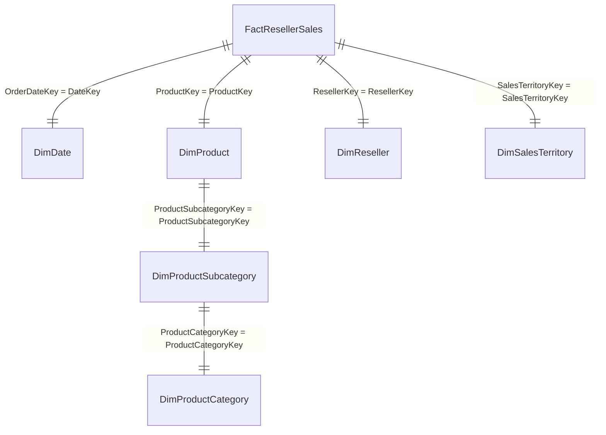

# Analytical Base Table (ABT) Technical Notes

**Project:** Microsoft AdventureWorks DW — Reseller Sales Profitability Analytics  
**Database Engine:** PostgreSQL 18.1  
**Target Table:** `abt_reseller_sales`  
**Primary Key / Grain:** `SalesOrderNumber` + `SalesOrderLineNumber`  
**Date Created:** September 8, 2026  

---

## 1. Purpose of the ABT

The **Analytical Base Table (`abt_reseller_sales`)** serves as the single source of truth and unified feature store for all downstream diagnostic analytics, including Price-Volume-Mix (PVM) variance decomposition, unit economics, gross profitability analysis, and segment-level margin diagnostics. 

By pre-joining the fact table (`FactResellerSales`) with all supporting dimensional tables (`DimDate`, `DimProduct`, `DimProductSubcategory`, `DimProductCategory`, `DimReseller`, `DimSalesTerritory`), the ABT eliminates runtime multi-table join overhead, guarantees zero dimension-mapping loss, and establishes a locked analytical scope.

---

## 2. Grain & Unique Identifier

- **Grain Definition:** **One row = One Sales Order Line**
- **Natural Composite Key:** `SalesOrderNumber` + `SalesOrderLineNumber`
- **Primary Key Constraint:** Enforced directly in PostgreSQL DDL as `PK_abt_reseller_sales` (`"SalesOrderNumber"`, `"SalesOrderLineNumber"`).
- **Aggregation:** No rows are aggregated. The line-item commercial grain is preserved with 100% fidelity.

---

## 3. Source Tables & Join Architecture

The ABT is constructed via inner joins across 7 normalized tables:

1. **`FactResellerSales` (Fact Source):** Line-item commercial quantities and financial amounts.
2. **`DimDate` (Time Dimension):** Joined on `OrderDateKey = DateKey`.
3. **`DimProduct` (Product Dimension):** Joined on `ProductKey = ProductKey`.
4. **`DimProductSubcategory` (Subcategory Hierarchy):** Joined on `ProductSubcategoryKey`.
5. **`DimProductCategory` (Category Hierarchy):** Joined on `ProductCategoryKey`.
6. **`DimReseller` (Reseller / Customer Dimension):** Joined on `ResellerKey`.
7. **`DimSalesTerritory` (Geography / Territory Dimension):** Joined on `SalesTerritoryKey`.

---

## 4. Locked Analytical Scope

The ABT is strictly filtered to:
- **Currency:** `CurrencyKey = 100` (USD transactions only).
- **Time Horizon:** `CalendarYear IN (2011, 2012)` (Calendar Years 2011 and 2012 only).
- **No Filter Alterations:** No products, categories, subcategories, resellers, or sales territories have been filtered out.

---

## 5. Field Dictionary & Schema Specification

| Category | Field Name | SQL Source / Formula | Data Type | Description |
| :--- | :--- | :--- | :--- | :--- |
| **Time** | `OrderDate` | `f.OrderDate` | `TIMESTAMP` | Timestamp of the sales order |
| | `CalendarYear` | `d.CalendarYear` | `SMALLINT` | Calendar Year (2011 or 2012) |
| | `CalendarMonth` | `d.EnglishMonthName` | `VARCHAR(10)` | Full English month name |
| | `CalendarMonthNumber` | `d.MonthNumberOfYear` | `SMALLINT` | Month number (1 - 12) |
| | `CalendarQuarter` | `d.CalendarQuarter` | `SMALLINT` | Calendar Quarter (1 - 4) |
| **Order** | `SalesOrderNumber` | `f.SalesOrderNumber` | `VARCHAR(20)` | Sales order document header ID |
| | `SalesOrderLineNumber`| `f.SalesOrderLineNumber`| `SMALLINT` | Line item sequence number within order |
| **Reseller** | `ResellerKey` | `f.ResellerKey` | `INTEGER` | Surrogate key for Reseller |
| | `ResellerName` | `r.ResellerName` | `VARCHAR(50)` | Commercial name of reseller |
| | `BusinessType` | `r.BusinessType` | `VARCHAR(20)` | Reseller business classification |
| | `AnnualSales` | `r.AnnualSales` | `NUMERIC(19,4)`| Annual sales revenue estimate |
| **Geography** | `SalesTerritoryKey` | `f.SalesTerritoryKey` | `INTEGER` | Surrogate key for Sales Territory |
| | `SalesTerritoryRegion`| `st.SalesTerritoryRegion`| `VARCHAR(50)` | Territory region name |
| | `SalesTerritoryCountry`| `st.SalesTerritoryCountry`| `VARCHAR(50)` | Territory country name |
| **Product** | `ProductKey` | `f.ProductKey` | `INTEGER` | Surrogate key for Product |
| | `ProductName` | `p.EnglishProductName` | `VARCHAR(50)` | Commercial product name |
| | `ProductSubcategoryKey`| `p.ProductSubcategoryKey`| `INTEGER` | Surrogate key for Subcategory |
| | `Subcategory` | `ps.EnglishProductSubcategoryName`| `VARCHAR(50)`| Product subcategory name |
| | `ProductCategoryKey` | `ps.ProductCategoryKey` | `INTEGER` | Surrogate key for Category |
| | `Category` | `pc.EnglishProductCategoryName`| `VARCHAR(50)`| Product category name |
| **Source Commercial**| `OrderQuantity` | `f.OrderQuantity` | `SMALLINT` | Quantity of units sold |
| | `UnitPrice` | `f.UnitPrice` | `NUMERIC(19,4)`| Stated unit list price |
| | `UnitPriceDiscountPct`| `f.UnitPriceDiscountPct`| `FLOAT8` | Commercial discount percentage |
| | `ExtendedAmount` | `f.ExtendedAmount` | `NUMERIC(19,4)`| Gross extended revenue (`OrderQuantity * UnitPrice`) |
| | `DiscountAmount` | `f.DiscountAmount` | `FLOAT8` | Total discount dollar amount |
| | `SalesAmount` | `f.SalesAmount` | `NUMERIC(19,4)`| Net revenue after discount |
| | `ProductStandardCost` | `f.ProductStandardCost` | `NUMERIC(19,4)`| Unit standard cost proxy |
| | `TotalProductCost` | `f.TotalProductCost` | `NUMERIC(19,4)`| Total product cost (`StandardCost * Quantity`) |
| **Derived Metrics**| `RealizedUnitPrice` | `SalesAmount / NULLIF(OrderQuantity, 0)` | `NUMERIC` | Realized net price per unit sold |
| | `GrossProfit` | `SalesAmount - TotalProductCost` | `NUMERIC` | Gross profit dollar contribution |
| | `GrossMarginPct` | `GrossProfit / NULLIF(SalesAmount, 0)` | `NUMERIC` | Gross profit margin percentage |
| | `DiscountRatePct` | `DiscountAmount / NULLIF(ExtendedAmount, 0)` | `NUMERIC` | Effective realized discount rate |
| | `UnitGrossProfit` | `RealizedUnitPrice - ProductStandardCost` | `NUMERIC` | Unit gross profit margin contribution |

---

## 6. Derived Metric Definitions & Division Protections

All division operations are explicitly wrapped in `NULLIF(..., 0)` to guarantee zero division-by-zero runtime exceptions:
1. **`RealizedUnitPrice`**: `SalesAmount / NULLIF(OrderQuantity, 0)`
2. **`GrossProfit`**: `SalesAmount - TotalProductCost`
3. **`GrossMarginPct`**: `GrossProfit / NULLIF(SalesAmount, 0)`
4. **`DiscountRatePct`**: `DiscountAmount / NULLIF(ExtendedAmount, 0)`
5. **`UnitGrossProfit`**: `RealizedUnitPrice - ProductStandardCost`

No values are rounded prematurely in the SQL engine to maintain full double-precision floating point / numeric accuracy for downstream statistical modeling.

---

## 7. Validation Suite Results (Phase 4 Reconciliation)

The ABT underwent a 7-point programmatic audit executed via `verify_abt.py`. All assertions passed with 100% accuracy.

| Validation Check | Expected Result | Actual Result | Status |
| :--- | :--- | :--- | :--- |
| **A. Row Count** | 23,539 | 23,539 | **PASS** |
| **B. Grain Uniqueness** | 23,539 unique keys | 23,539 unique keys | **PASS** |
| **C. Scope Integrity** | `CurrencyKey = 100`, `Years IN (2011, 2012)` | `CurrencyKey = [100]`, `Years = [2011, 2012]` | **PASS** |
| **D. Join Mapping** | 0 `NULL` dimension fields | 0 `NULL` dimension fields | **PASS** |
| **E. Financial Reconciliation** | Exact match vs `FactResellerSales` | Variance = `0.000000` | **PASS** |
| **F. Derived Metric Logic** | 0 mathematical mismatches | 0 mathematical mismatches across 9 equations | **PASS** |
| **G. Duplicate Check** | 0 duplicate composite keys | 0 duplicates | **PASS** |

### Financial Totals Comparison (Fact Source vs ABT Table)

- **`OrderQuantity`:** 79,887 units (Exact Match)
- **`ExtendedAmount`:** $35,568,833.7611 (Exact Match)
- **`DiscountAmount`:** $193,375.2714 (Exact Match)
- **`SalesAmount`:** $35,375,458.5019 (Exact Match)
- **`TotalProductCost`:** $34,643,035.7873 (Exact Match)

---

## 8. Design Choice Rationale (Physical Table vs Dynamic View)

- **Selected Design:** **Physical Table (`abt_reseller_sales`)**
- **Rationale:** 
  1. **Analytical Snapshot Stability:** Physical table creation freezes the analytical baseline at the locked scope, preventing downstream diagnostic variance from accidental source table mutations.
  2. **Query Performance:** Downstream Price-Volume-Mix (PVM) and segment diagnostic algorithms execute sequential scans over indexed physical blocks without incurring 7-table JOIN overhead on every query.
  3. **Storage Efficiency:** The dataset footprint is ~5.2 MB, representing negligible storage overhead for massive performance and stability gains.

---

## 9. Analytical Limitations

1. **COGS Standard Cost Proxy:** `ProductStandardCost` and `TotalProductCost` reflect Microsoft AdventureWorks standard cost estimates, not realized actual production or lot-based historical costs.
2. **Discount Scope:** Commercial discounts are evaluated as a secondary diagnostic factor and are not isolated as a primary PVM driver.
3. **Horizon Scope:** Excludes CY2010 and CY2013 data to focus on complete, comparable annual periods (CY2011 vs CY2012).

---

## 10. Decision Log Updates

- **DECISION 1:** Source CSVs in `data/raw/` remain untouched; staging sanitization is isolated to NUL-byte stripping on `DimProduct`.
- **DECISION 2:** PostgreSQL 18.1 is locked as the database engine with strict primary key and foreign key constraints.
- **DECISION 3 (NEW):** Scope is locked to `CurrencyKey = 100` (USD) and `CalendarYear IN (2011, 2012)` comprising **23,539 rows**.
- **DECISION 4 (NEW):** ABT grain is permanently established at line-item detail (`SalesOrderNumber + SalesOrderLineNumber`) without pre-aggregation.
- **DECISION 5 (NEW):** COGS metric fields (`ProductStandardCost`, `TotalProductCost`) are treated strictly as standard cost proxies.
